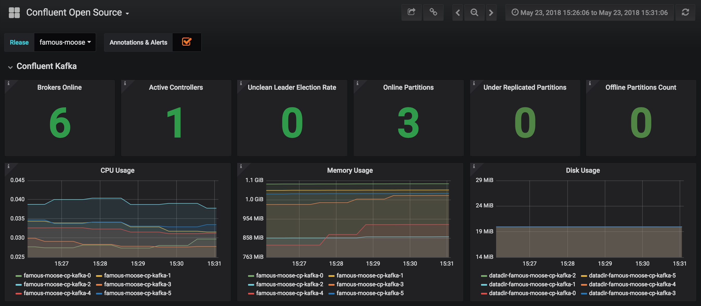
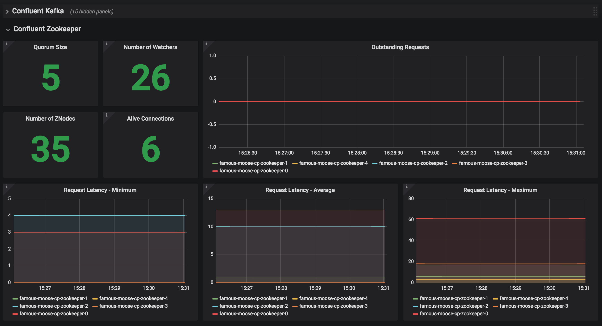

= Confluent Platform Helm Charts
:icons: font
:toc: auto
:toc-placement: macro
:toc-position: auto
:toc-title: Table of content
:toclevels: 3
:idprefix:
:idseparator: -
:sectanchors:
:icons: font
:source-highlighter: rouge
:experimental:

toc::[]

5GMETA Kafka Broker is based on  Confluent Platform and is deployed using https://github.com/confluentinc/cp-helm-charts[Confluent Platform Helm Charts].
This documentation is an adapted version of the Confluent Platform README. 

== Installation

[source,bash]
.Installing helm chart
----
helm repo add confluentinc https://confluentinc.github.io/cp-helm-charts/   #<1>
helm repo update    #<2>
helm install confluentinc/cp-helm-charts --name my-confluent --version 0.6.0    #<3>
----
<1> Add `confluentinc` helm charts repo
<2> Update repo information 
<3> Install Confluent Platform with release name «my-confluent» and version `0.6.0` 

== Documentation

https://helm.sh/[Helm] is an open-source packaging tool that helps you install applications and services on Kubernetes.
Helm uses a packaging format called charts.
Charts are a collection of YAML templates that describe a related set of Kubernetes resources.

This repository provides Helm charts for the following Confluent
Platform services:

* ZooKeeper
* Kafka brokers
* Kafka Connect
* Confluent Schema Registry
* Confluent REST Proxy
* ksqlDB

=== Environment Preparation

You must have a Kubernetes cluster that has Helm configured.

==== Tested Software

These Helm charts have been tested with the following software versions:

* https://kubernetes.io/[Kubernetes] 1.9.2+
* https://helm.sh/[Helm] 3+
* https://hub.docker.com/u/confluentinc/[Confluent Platform Docker Images]

For local Kubernetes installation with Minikube, see <<create-local-minikube>>.

==== Install Helm on Kubernetes

Follow the directions to https://docs.helm.sh/using_helm/#quickstart-guide[install and deploy Helm] to the Kubernetes cluster.

View a list of all deployed releases in the local installation.

[source,sh]
----
helm init
helm repo update
helm list
----

[source,sh]
----
kubectl delete --namespace kube-system svc tiller-deploy
kubectl delete --namespace kube-system deploy tiller-deploy
kubectl create serviceaccount --namespace kube-system tiller
kubectl create clusterrolebinding tiller-cluster-rule --clusterrole=cluster-admin --serviceaccount=kube-system:tiller
kubectl patch deploy --namespace kube-system tiller-deploy -p '{"spec":{"template":{"spec":{"serviceAccount":"tiller"}}}}'
helm init --service-account tiller --upgrade
----

=== Persistence

The ZooKeeper and Kafka cluster deployed with `StatefulSets` that have a `volumeClaimTemplate` which provides the persistent volume for each replica.
You can define the size of the volumes by changing `dataDirSize` and `dataLogDirSize` under `cp-zookeeper` and `size` under `cp-kafka` in https://github.com/confluentinc/cp-helm-charts/blob/master/values.yaml[values.yaml].

You also could use the cloud provider's volumes by specifying https://kubernetes.io/docs/concepts/storage/storage-classes/[StorageClass].
For example, if you are on AWS your storage class will look like this:

[source,yaml]
----
apiVersion: storage.k8s.io/v1beta1
kind: StorageClass
metadata:
  name: ssd
provisioner: kubernetes.io/aws-ebs
parameters:
  type: gp2
----

NOTE: To adapt this example to your needs, read the Kubernetes https://kubernetes.io/docs/concepts/storage/storage-classes/#parameters[StorageClass] documentation.

The `StorageClass` that was created can be specified in `dataLogDirStorageClass` and `dataDirStorageClass` under `cp-zookeeper` and in `storageClass+` under `cp-kafka` in https://github.com/confluentinc/cp-helm-charts/blob/master/values.yaml[values.yaml].

To deploy non-persistent Kafka and ZooKeeper clusters, you must change  the value of `persistence.enabled` under `cp-kafka` and `cp-zookeeper` in https://github.com/confluentinc/cp-helm-charts/blob/master/values.yaml[values.yaml]

WARNING: These type of clusters are suitable for *strictly* development and testing  purposes.
The `StatefulSets+` are going to use `emptyDir` volumes, this means that its content strictly related to the pod life cycle and is deleted when the pod goes down.

=== Install Confluent Platform Charts

The installation of confluentic Kafka distribution is done with other 5GMETA Cloud Platform tools. In this document, it is described how to test the installed kafka distribution. 

=== Verify Installation

==== Verify Kafka cluster

NOTE: _This step is optional_ - to verify that Kafka is working as expected, connect to one of the Kafka pods and produce some messages to a Kafka topic.
[source,sh]
.List your pods and wait until they are all in `+Running+` state.
----
kubectl get pods
----

.Connect to the container `cp-kafka-broker` in a Kafka broker pod to  produce messages to a Kafka topic.

[source,sh]
----
kubectl exec -n cloud-platform -c cp-kafka-broker -it cloud-platform-cp-kafka-0 -- /bin/bash /usr/bin/kafka-console-producer --broker-list localhost:9092 --topic test
----

Wait for a `>` prompt, and enter some text.

----
m1
m2
----

Press kbd:[Ctrl + C] to close the producer session.

. Consume the messages from the same Kafka topic as above.
[source,sh]
----
kubectl exec -n cloud-platform -c cp-kafka-broker -it cloud-platform-cp-kafka-0 -- /bin/bash  /usr/bin/kafka-console-consumer --bootstrap-server localhost:9092 --topic test --from-beginning
----

You should see the messages which were published from the console producer. 
Press kbd:[Ctrl + C] to stop consuming.

==== Manual Test

===== Zookeepers

----
kubectl apply -f confluentic-apachekafka-chart/test/zookeeper-client.yaml  -n cloud-platform     #<2>
...
kubectl exec -n cloud-platform -it zookeeper-client -- /bin/bash /usr/bin/zookeeper-shell cloud-platform-cp-zookeeper:2181 ls /brokers/ids       #<3>
kubectl exec -n cloud-platform -it zookeeper-client -- /bin/bash /usr/bin/zookeeper-shell cloud-platform-cp-zookeeper:2181 get /brokers/ids/0
kubectl exec -n cloud-platfrom -it zookeeper-client -- /bin/bash /usr/bin/zookeeper-shell cloud-platform-cp-zookeeper:2181 ls /brokers/topics    #<4>
----
<1> Clone Helm Chars git repository
<2> Deploy a client pod.
<3> Connect to the client pod and use the `+zookeeper-shell+` command to  explore brokers...
<4> topics, etc.

===== Kafka

[source,bash]
.Validate Kafka installation 
----
kubectl apply -f confluentic-apachekafka-chart/kafka-client.yaml -n cloud-platfrom #<1>
kubectl exec -n cloud-platform -it kafka-client -- /bin/bash      #<2>
----
<1> Deploy a Kafka client pod.
<2> Log into the Pod

[source,bash]
.From within the kafka-client pod, explore with kafka commands:
----
## Setup
export RELEASE_NAME=cloud-platform
export ZOOKEEPERS=${RELEASE_NAME}-cp-zookeeper:2181
export KAFKAS=${RELEASE_NAME}-cp-kafka-headless:9092

## Create Topic
kafka-topics --zookeeper $ZOOKEEPERS --create --topic test-rep-one --partitions 6 --replication-factor 1

## Producer
kafka-run-class org.apache.kafka.tools.ProducerPerformance --print-metrics --topic test-rep-one --num-records 6000000 --throughput 100000 --record-size 100 --producer-props bootstrap.servers=$KAFKAS buffer.memory=67108864 batch.size=8196

## Consumer
kafka-consumer-perf-test --broker-list $KAFKAS --messages 6000000 --threads 1 --topic test-rep-one --print-metrics
----

==== Run A Streams Application

ksqlDB is the streaming SQL engine that enables real-time data  processing against Apache Kafka.
Now that you have running in your Kubernetes cluster, you may run:

## Ksql
kubectl apply -f confluentic-apachekafka/tests/ksql-demo.yaml -n cloud-platform
----

==== Monitoring

JMX Metrics are enabled by default for all components, Prometheus JMX  Exporter is installed as a sidecar container along with all Pods.

. Add Prometheus as Data Source in Grafana, url should be something  like: `+http://illmannered-marmot-prometheus-server:9090+`
. Import dashboard under https://github.com/confluentinc/cp-helm-charts/blob/master/grafana-dashboard/confluent-open-source-grafana-dashboard.json[grafana-dashboard] into Grafana 

=== Teardown

To remove the pods, list the pods with `kubectl get pods` and then delete the pods by name.

[source,sh]
----
kubectl get pods
kubectl delete pod <podname>
----

To delete the Helm release, find the Helm release name with `helm list` and delete it with `helm delete`.
You may also need to  clean up leftover `StatefulSets`, since `helm delete` can leave them  behind.
Finally, clean up all persisted volume claims (pvc) created by  this release.

[source,sh]
----
helm list
helm delete <release name>
kubectl delete statefulset <release name>-cp-kafka <release name>-cp-zookeeper
kubectl delete pvc --selector=release=<release name>
----

== Thanks

Huge thanks to:

* https://github.com/kubernetes/charts/tree/master/incubator/kafka[Kafka helm chart]
* https://github.com/kubernetes/charts/tree/master/incubator/zookeeper[ZooKeeper helm chart]
* https://github.com/kubernetes/charts/tree/master/incubator/schema-registry[Schema Registry helm chart]
* https://github.com/Yolean/kubernetes-kafka[kubernetes-kafka]
* https://github.com/solsson/dockerfiles[docker-kafka]
