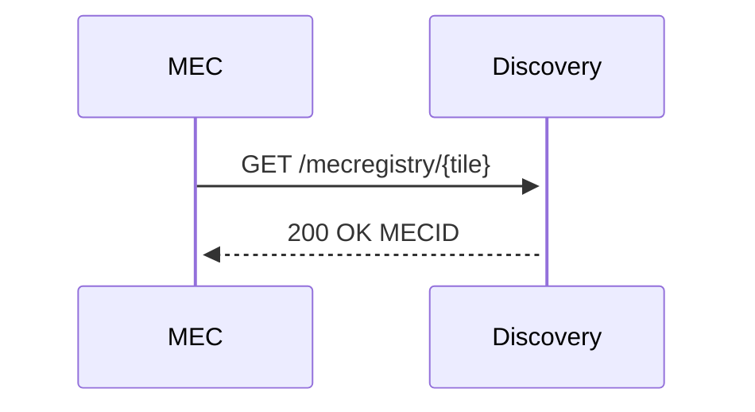
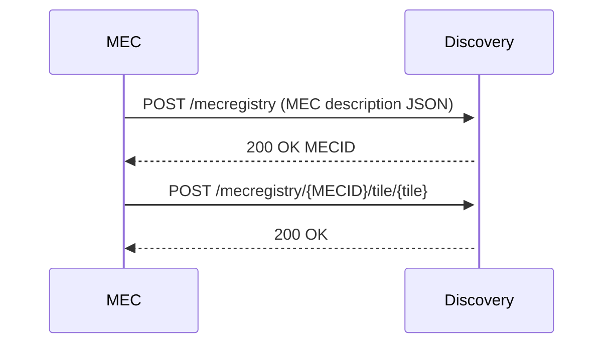
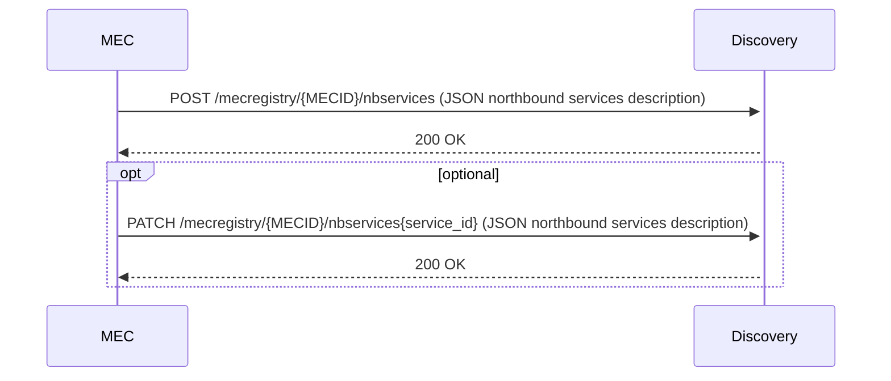
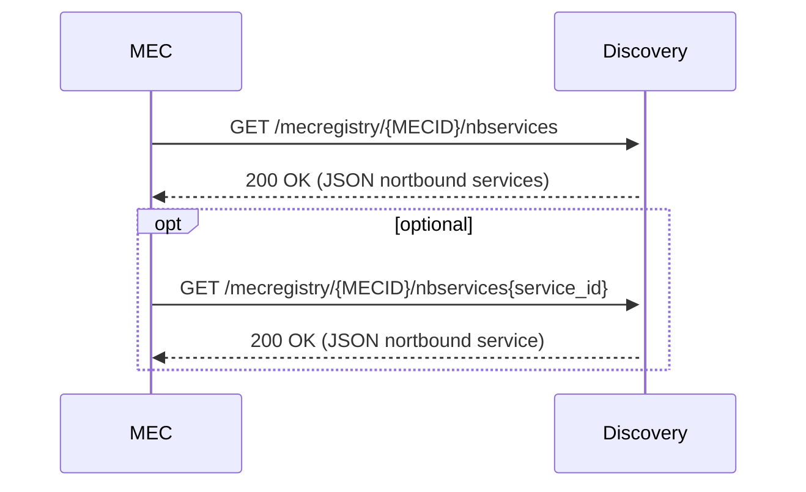
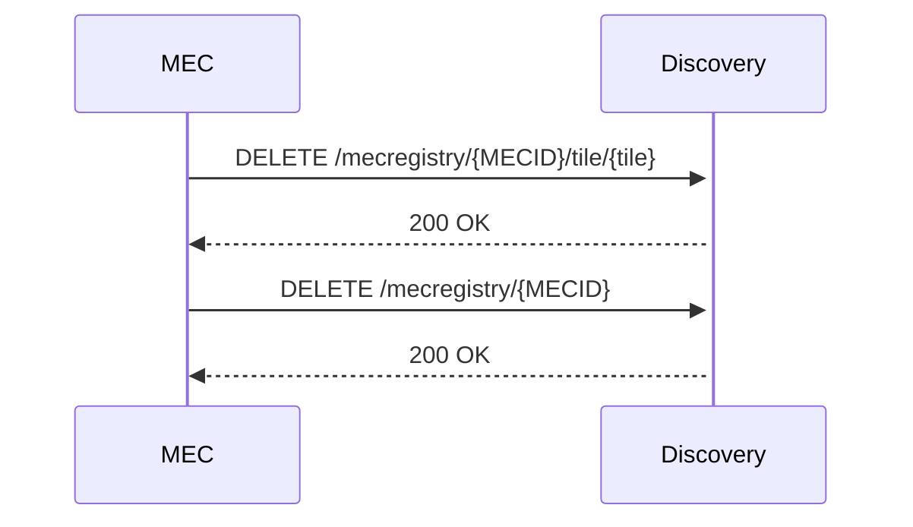

# ThE 5GMETA Cloud Platform API Serve

This folder contains the projects used by the cloud-platform such as the apiserver.
This API is in charge of managing all neccessary information about MECs and their capabilities, coverage zones (tiles) and services provided by them to 3rd party applications and to 5GMETA platform members.
This API  uses the [Connexion](https://github.com/zalando/connexion) library on top of Flask.

## Requirements

- Python 3.13

## Pre-requisites

This API has to be deployed in a Kubernetes running environment. 

It needs access to:
 - a sql database called dataflowdb defined by [https://github.com/5gmeta/dataflow_cloud/blob/main/src/mysql/dataflow_DB_CLOUD_mysql.sql](https://github.com/5gmeta/dataflow_cloud/blob/main/src/mysql/dataflow_DB_CLOUD_mysql.sql) and
 - a database discoverydb defined by [https://github.com/5gmeta/discovery/blob/main/src/data/sql/database.sql](https://github.com/5gmeta/discovery/blob/main/src/data/sql/database.sql). 

Please refer to [https://github.com/5gmeta/platform-config/blob/main/docs/cloud-database.md](https://github.com/5gmeta/platform-config/blob/main/docs/cloud-database.md) to get more information about database deployment.


## Usage

To run the server in developemnt,  execute the following commands from the root directory:

```
pip3 install -r requirements.txt
python3 -m openapi_server
```

and open your browser to here:

```
http://localhost:5000/cloudinstance-api/ui/
```

Your OpenAPI definition lives here:

```
http://localhost:5000/openapi.json
```

## Running with Docker

To run the server on a Docker container, please execute the following from the root directory:

```bash
cd src/

# building the image
docker build -t cloudinstance-api .

# starting up a container
docker run -p 5000:5000 cloudinstance-api
```

## Building image

Go to [/src/python-flask-server-generated](/src/python-flask-server-generated):

```
docker build -t swagger_server .
```

Please refer to  [/src/python-flask-server-generated/README.md](/src/python-flask-server-generated/README.md) to get more information about building.

## Deployment

Deployment of discovery API in the production environment has to be made by deploying the helmchart defined on [https://github.com/5gmeta/helmcharts/tree/main/charts/discoveryapi-chart](https://github.com/5gmeta/helmcharts/tree/main/charts/discoveryapi-chart) 

### Interactions 

The different functions provided are depicted in different diagrams:

### Get MECID containing a Tile



### Register a new MEC



### Register northbound services into a MEC



### Get northbound from MEC



### Get northbound services from given MEC


### Delete a MEC



## How it will be used
The MEC discovery will be used by two actors: S&D and MEC.
(i) A S&D can ask to the MEC Discovery service to receive the information about the available MECs in its area;
(ii) A MEC register its information in its area of coverage.

The interaction are through APIs, when you are running the service you can see the UI APIs at the address: `ServiceIP:8080/v0/ui/`
 
### How to run MEC Discovery
Run the command:

 `sudo docker-compose up -d`


In the following generic information about the tools used in the service are provided.

### Tools and framework used in the MEC Discovery
The MEC discovery is developed using python, Flask API, MySQL database, Swagger tools for OpenAPI 3.0.

### Docker service Flask

`sudo docker build -t service-flask .`

`sudo docker run -d -p 5000:5000 service-flask`


## Credits

* Felipe Mogollón ([fmogollon@vicomtech.org](mailto:fmogollon@vicomtech.org))


# TODO

1. Ensure that this README contains the relevant information from the follwoing project:
  - https://github.com/Akkodis/cloud-instance-api
  - https://github.com/Akkodis/discovery.git
  - dataflow-api
  - etc.
  
(On going, info retrieved in README, test all)
2. Re-draw the diagrams
